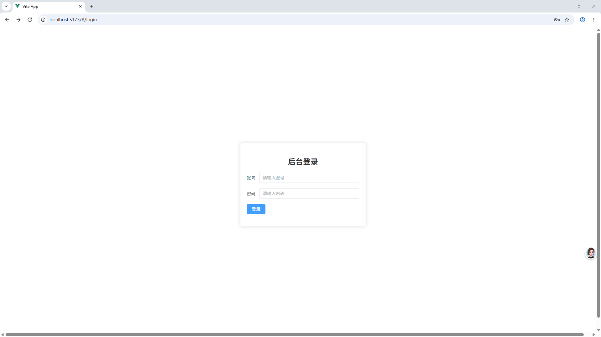
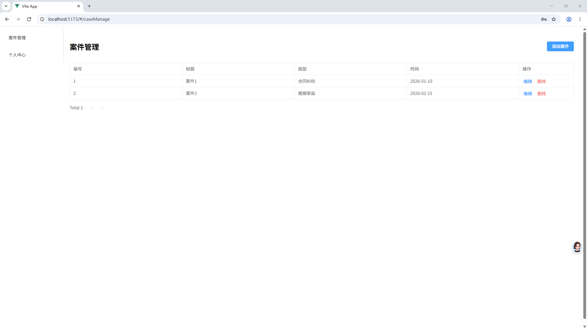
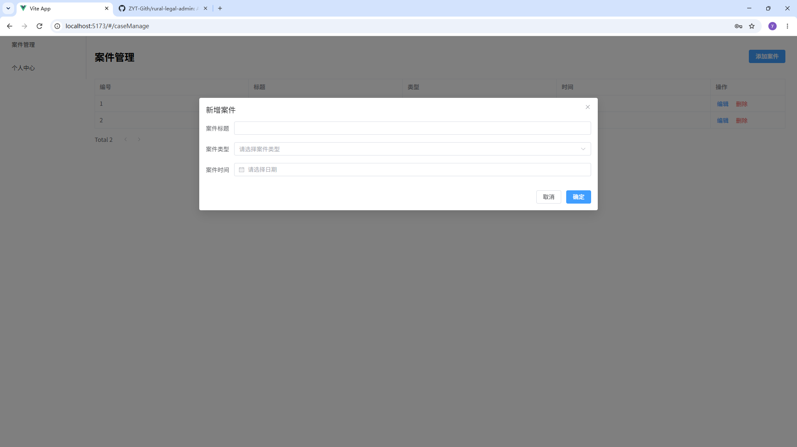
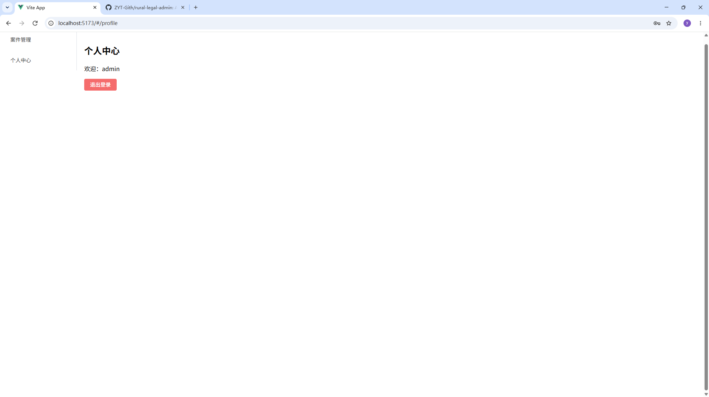

# 乡村法务后台管理系统

> 一个基于 Vue3 + Vite + Pinia + VueRouter4 + Element Plus 的现代化乡村法务管理后台系统。

## 项目简介

乡村法务后台管理系统是一款专为乡村法律服务场景设计的后台管理平台。系统旨在通过数字化手段，提升乡村法务工作的效率和透明度，为基层法律工作者提供便捷的案件管理、用户管理和个人信息维护工具。

系统采用现代化的前端技术栈构建，界面简洁友好，操作流程清晰。

## 功能特性

### 核心功能

- **登录鉴权系统**
  - 账号密码登录校验（模拟后台接口）
  - Token 登录状态本地持久化（localStorage，刷新页面保持登录）
  - 全局路由守卫，未登录用户禁止直接访问后台页面，强制跳转登录页
  - 退出登录，清除本地存储、清空登录状态

- **案件管理模块（CRUD）**
  - **案件列表**: 分页展示所有案件信息
  - **案件创建**: 弹窗表单录入案件，日期固定 `YYYY-MM-DD` 格式
  - **案件编辑**: 复用弹窗回填数据，修改案件信息
  - **案件删除**: 删除选中案件记录

- **个人中心**
  - **展示登录用户名**
  - **退出登录** 功能

### 技术特性

- **现代化技术栈**: Vue3, Vite, Pinia, VueRouter4, Element Plus
- **组件化开发**: 基于 Element Plus 组件库快速搭建后台页面
- **状态管理**: Pinia 管理全局用户登录状态
- **路由管理**: VueRouter4，全局前置守卫做页面权限拦截
- **本地存储**: localStorage 持久化保存登录token

## 技术栈

| 技术 | 版本 | 描述 |
|------|------|------|
| Vue.js | 3.x | 渐进式 JavaScript 框架 |
| Vite | 4.x | 新一代前端构建工具 |
| Pinia | 2.x | Vue3 官方推荐状态管理库 |
| Vue Router | 4.x | Vue.js 的官方路由管理器 |
| Element Plus | 2.x | Vue3桌面端UI组件库 |
| Axios | 1.x | HTTP客户端（预留对接后端接口） |

## 项目截图

### 登录页面


### 案件管理列表


### 案件管理列表



### 个人中心


## 快速开始

### 环境要求
- Node.js >= 16.0.0
- npm >= 7.0.0

### 安装步骤

1. **克隆项目**
   ```bash
   git clone https://github.com/ZYT-Gith/rural-legal-admin.git
   cd rural-legal-admin
   ```

2. **安装依赖**
   ```bash
   npm install
   ```

3. **运行开发服务器**
   ```bash
   npm run dev
   ```

   > 测试账号：`admin`　密码：`123456`

4. **构建生产版本**
   ```bash
   npm run build
   ```

5. **预览生产版本**
   ```bash
   npm run preview
   ```

## 项目结构

```plaintext
src/
├── api/             # API 请求封装（预留后端对接）
│   └── user.js      # 用户相关 API
├── assets/          # 静态资源文件
├── router/          # 路由配置
│   └── index.js     # 路由 + 全局路由守卫
├── stores/          # Pinia 状态管理
│   └── user.js      # 用户登录状态、token管理
├── views/           # 页面组件
│   ├── CaseManage.vue  # 案件管理页面（增删改查）
│   ├── Login.vue       # 登录页面（回车快捷登录）
│   └── Profile.vue     # 个人中心页面
├── App.vue          # 根组件
└── main.js          # 入口文件
```